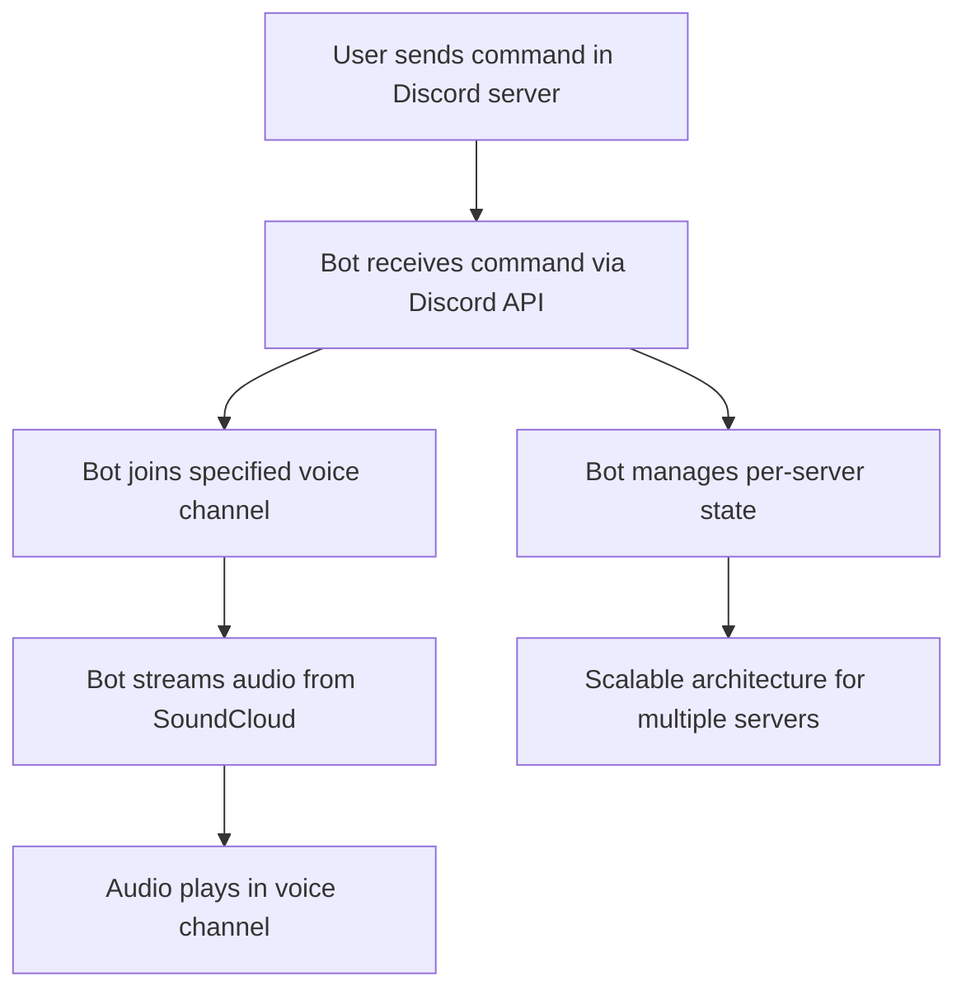

# Discord Music Bot MVP – Planning & Architecture

## MVP Goal
- Connect to a Discord server
- Join a voice channel
- Play a song from SoundCloud
- Support multiple servers (guilds) concurrently

---

## Tech Stack
- **Language:** Node.js (JavaScript/TypeScript)
- **Discord API Library:** [discord.js](https://discord.js.org/) (v14+)
- **Voice Support:** [@discordjs/voice](https://discordjs.guide/voice/) (for audio streaming)
- **SoundCloud Integration:** [soundcloud-downloader](https://www.npmjs.com/package/soundcloud-downloader) or similar
- **Deployment:** Docker (for containerization), scalable cloud hosting (e.g., AWS, GCP, Azure, or VPS)
- **Optional for Scale:** Redis (for shared state/cache), message queue (for microservices), Kubernetes (for orchestration)

---

## High-Level Architecture

---

## Discord API Requirements & Concepts
- **Gateway:** WebSocket connection for real-time events (messages, voice state, etc.)
- **REST API:** For actions (send message, join channel, etc.)
- **Voice Gateway:** Separate WebSocket for voice channel operations
- **Sharding:** Required for bots in 2,500+ servers; recommended for scale
- **Intents:** Specify which events the bot receives (optimize for performance)
- **Caching:** Local cache for guilds, channels, members; can be tuned for memory/performance

---

## Scalability Considerations
- **Per-server (guild) state:** Each server may have its own music queue, playback state, etc.
- **Stateless command handling:** Prefer stateless/microservice design for horizontal scaling
- **Sharding:** Use Discord.js built-in sharding or a cluster manager (e.g., Kurasuta, Eris-fleet)
- **Distributed cache/state:** Use Redis or similar if state must be shared across instances
- **Voice connections:** Each server's voice connection is independent; must manage concurrency
- **Rate limits:** Respect Discord API rate limits (REST and Gateway)

---

## MVP Feature Breakdown
- [ ] Connect to Discord and respond to commands
- [ ] Join a specified voice channel
- [ ] Play a SoundCloud track (given a URL)
- [ ] Handle basic errors (e.g., invalid URL, not in voice channel)
- [ ] Support multiple servers concurrently
- [ ] (Optional) Simple queue per server

---

## MVP Constraints
- **SoundCloud only:** The MVP will only support playing tracks from SoundCloud. No YouTube/Spotify integration is planned for now.
- **No queue persistence:** Music queues do not need to persist across bot restarts; no database is required for MVP.
- **Single server (guild):** The MVP is intended to run in only one Discord server/guild.
- **No premium features or authentication:** The MVP will not include premium features or require user authentication.
- **Personal use only:** The MVP is not intended to be deployable by others or as a multi-tenant SaaS.

---

## Open Questions / To Clarify
- (None for MVP)

---

## References & Further Reading
- [discord.js Guide](https://discordjs.guide/)
- [Discord API Docs](https://discord.com/developers/docs/intro)
- [Scaling Discord Bots (Whitepaper)](https://github.com/shitcorp/Discord-Bots-At-Scale)
- [Microservice Bots (Whitepaper)](https://gist.github.com/DasWolke/c9d7dfe6a78445011162a12abd32091d)

---

*Update this document as requirements evolve or new architectural decisions are made.* 